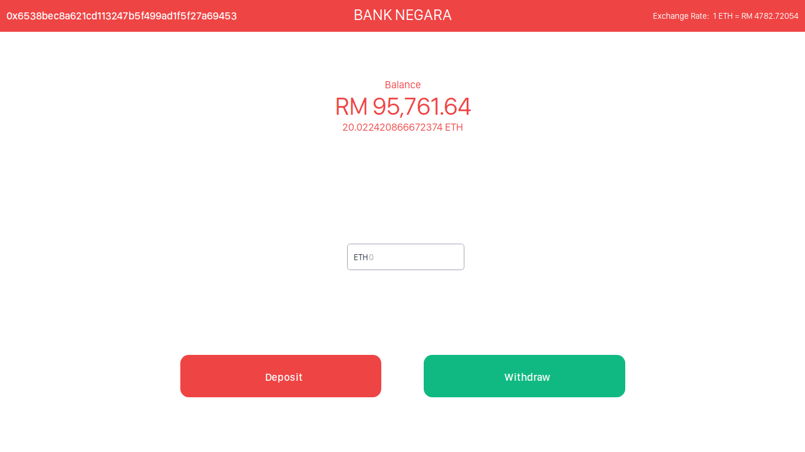
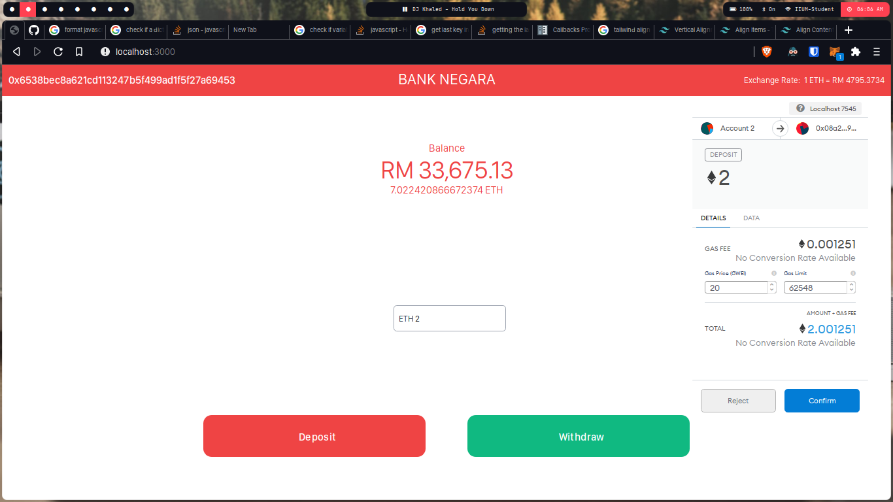
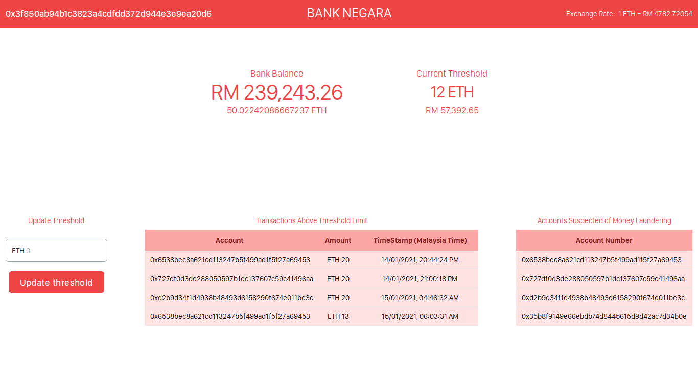

# Bank-Negara-Dapp

a decentralized App representing a bank

## Features

### General

- contract address used as bank.
- tests for all contract functions.
- strict checks using modifiers.
- strict checks in web interface.
- different interface for admin and regular customers.
- up to date exchange rate via coinbase API.

### Admin

- Set Transaction Threshold.
- recive alert when transaction is above threshold.
- recive alert when the bank has a balance of more than 50 ethers (a case of money laundering).

### Users

- Deposit.
- Withdraw.

## Requirements

- [Metamask](https://metamask.io/)
- [nodejs](https://nodejs.org/en/download/)
- [Truffle](https://www.trufflesuite.com/)
- [ganache](https://www.trufflesuite.com/ganache)
- install required packages with `npm install`

## Development

- Compile code via `truffle compile`
- deploy to ganache using `truffle migrate --reset`
- `truffle console` to interact with the deployed contract

## Contract Tests

- tests are located in the test folder
- to run tests run `truffle test`

## Deployment

the contrct is already deployed to the ropstan test network using [infura](http://infura.io/), to redeploy you need to use the first account from the accounts generated by the seed phrase in truffle-config.json.  
more information on how to deploy and intract with contracts on infura in this [guide](https://blog.infura.io/deploying-smart-contracts-managing-transactions-ethereum/). 

- deployed contract address: [ropstan](https://ropsten.etherscan.io/address/0x8f129e60fd0a99128b234ab2ad434178df78442d).
- run `truffle migrate --network ropstan` to deploy to ropstan test network

## Web Interface development

there are 2 user interfaces, one for the customer and another for the admin/regulator,
which one is loaded depends on the account selected in metamask,
if its the first account in ganache then its the admin,
to add accounts from ganache to metamask follow [this guide](https://www.trufflesuite.com/docs/truffle/getting-started/truffle-with-metamask).

- start the server using `npm run dev`

## Web Interface Preview

### Customer

  

### Admin

